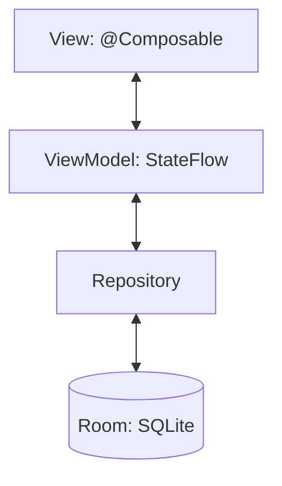
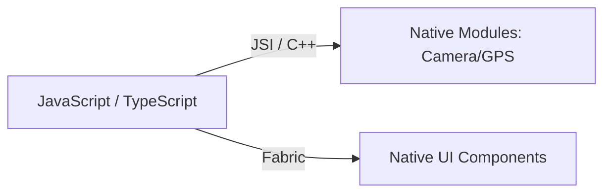

# Полное руководство по архитектуре: Лабораторные №12.1 и №12.2

Этот документ представляет собой углубленное техническое исследование современных подходов к мобильной разработке, реализованных в проектах Jetpack Compose и React Native.

---

## 1. Лабораторная №12.1: Native Android (Jetpack Compose)

### Архитектура: Реактивный MVVM
В проекте реализован паттерн **Model-View-ViewModel**, усиленный реактивными потоками данных.



#### Глубокая теория "под капотом":
1.  **Slot Table (Таблица слотов)**: Каждая `@Composable` функция при исполнении записывает свои данные в Slot Table. Это позволяет Compose «помнить», где в дереве UI находится конкретный элемент. Если стейт не изменился, Compose просто проигрывает данные из таблицы вместо повторного вычисления функции.
2.  **Smart Recomposition**: Compose — это интеллектуальный движок. Он перерисовывает не весь экран, а только те функции, чьи параметры изменились.

#### Пример кода (Jetpack Compose):
```kotlin
// ViewModel: Единственный источник истины (UDF)
class NotesViewModel(private val repository: NoteRepository) : ViewModel() {
    private val _notes = MutableStateFlow<List<Note>>(emptyList())
    val notes: StateFlow<List<Note>> = _notes.asStateFlow()
}

// UI: Декларативное описание
@Composable
fun NotesScreen(viewModel: NotesViewModel) {
    val notes by viewModel.notes.collectAsState() // Авто-подписка на обновления
    
    LazyColumn {
        items(notes) { note ->
            NoteCard(note) // Эта функция вызовется только если данные заметки изменятся
        }
    }
}
```

---

## 2. Лабораторная №12.2: Cross-platform (React Native)

### Архитектура: Синхронная Новая Архитектура
Здесь мы перешли от старого **Bridge** к новому **JSI (JavaScript Interface)**.



#### Ключевые термины для защиты:
1.  **Yoga Engine**: Движок на C++, который берет ваш Flexbox (из JS) и превращает его в координаты пикселей для Android (через MeasureSpec) и iOS.
2.  **TurboModules**: Теперь нативные модули не грузятся все сразу при старте (что долго), а подключаются лениво только при первом обращении.
3.  **Virtual DOM vs Shadow Tree**: В React Native нет браузерного DOM. Вместо него строится Shadow Tree, которое через движок Fabric транслирует изменения в нативные View.

#### Пример кода (React Native + Redux RTK):
```typescript
// Slice: Логика обновления данных
const notesSlice = createSlice({
  name: 'notes',
  initialState,
  reducers: {
    addNote: (state, action) => {
      state.items.push(action.payload); // Использует Immer.js (мутируем безопасно)
    },
  },
});

// UI: Функциональный компонент
const NotesList = () => {
  const notes = useSelector((state) => state.notes.items); // Селектор данных из Store
  
  return (
    <FlatList
      data={notes}
      renderItem={({ item }) => <NoteItem title={item.title} />}
    />
  );
};
```

---

## 3. Сравнительный анализ: Родной код против Кроссплатформы

| Характеристика | Jetpack Compose (Native) | React Native (Cross-platform) |
| :--- | :--- | :--- |
| **Ядро** | Kotlin / ART (JVM) | JavaScript (Hermes Engine) |
| **Рендеринг** | Напрямую Android Canvas | Yoga (C++) -> Native Views |
| **Управление памятью** | Garbage Collector (Android) | GC (Hermes) + Счётчик ссылок в C++ |
| **Скорость запуска** | Мгновенно (AOT) | Высокая (Pre-compiled Bytecode) |
| **Типизация** | Строгая (Kotlin) | Статическая (TypeScript) |

> [!IMPORTANT]
> **Почему 12.1 быстрее?** В нативном коде нет прослойки между логикой и экраном. 
> **Почему 12.2 удобнее?** Один и тот же код (Redux-логика, бизнес-правила) на 90% совпадает для Android, iOS и даже Web-версии, которую мы подняли.

---

## 4. Ответы на "экзаменационные" вопросы

**В: Что такое SideEffect в Compose?**
О: Это механизм выхода из «чистого» мира функций Compose в мир побочных эффектов (логирование, сетевые запросы). Примеры: `LaunchedEffect`, `SideEffect`.

**В: В чем преимущество движка Hermes в React Native?**
О: Он компилирует JS в байт-код заранее (AOT), что критически ускоряет запуск приложения на слабых устройствах и потребляет меньше памяти.

**В: Зачем нам нужен Repository в MVVM?**
О: Чтобы скрыть от ViewModel детали хранения данных. ViewModel не должна знать, откуда пришли заметки — из SQLite базы (Room) или из интернета. Это принцип **Separation of Concerns (SoC)**.

---

## 5. Заключение

Лабораторные работы демонстрируют эволюцию мобильной индустрии: от императивного кода к **декларативному состоянию**. И Jetpack Compose, и React Native используют идею: **"UI — это функция от состояния" (UI = f(State))**.
