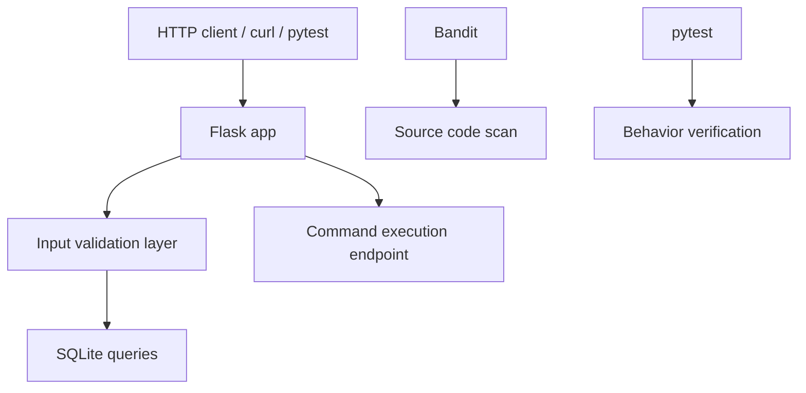
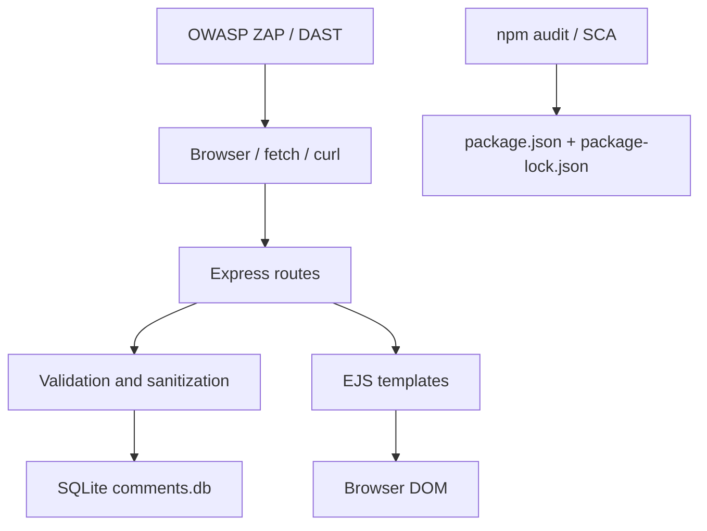
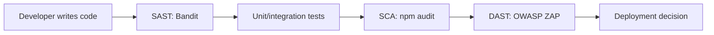

# Полное руководство по архитектуре: Лабораторная работа №13

Этот файл сделан в том же духе, что и теоретический файл из `python-lab-12`: его можно использовать как шпаргалку для защиты. Здесь собрана не только теория по DevSecOps, но и архитектура двух практических частей лабораторной, причины исправлений и готовые формулировки для ответов.

---

## 1. Общая идея лабораторной

Лабораторная №13 показывает, что безопасность в SDLC нельзя рассматривать как отдельный финальный этап. В работе демонстрируются три слоя контроля:

1. `SAST` — анализ самого исходного кода до запуска приложения.
2. `SCA` — анализ сторонних зависимостей и известных CVE.
3. `DAST` — проверка уже работающего веб-приложения снаружи.

В практической части это разделено на два мини-проекта:

- `python-lab-13.1` — Flask API, где через Bandit и тесты показывается переход от уязвимого Python-кода к безопасному.
- `python-lab-13.2` — Node.js/Express-приложение с комментариями, где разбираются XSS, SQL injection, hardcoded secrets, CSP и анализ зависимостей.

---

## 2. Архитектура лабораторной №13.1: SAST с Bandit

### Архитектурная идея

Первая часть построена как сравнение двух реализаций одного и того же сервиса:

- `vulnerable_app.py` — намеренно уязвимый вариант.
- `secure_app.py` — исправленный вариант.
- `test_apps.py` — набор тестов, который подтверждает поведение обоих сценариев.
- `run_analysis.py` — сценарий запуска Bandit и pytest.

Получается не просто “код + отчёт”, а учебный стенд, где видно и уязвимость, и её исправление, и подтверждение тестами.



### Логическая структура приложения

Во Flask-части есть четыре ключевых сценария:

1. Получение пользователя по `id`.
2. Поиск пользователей по `username`.
3. Доступ к чувствительным данным через `/api/data`.
4. Выполнение команды через `/execute`.

Именно на этих сценариях показаны типовые проблемы secure coding:

- SQL injection.
- Hardcoded secrets.
- Command injection.
- Небезопасный debug-режим.

### Что было уязвимо в `vulnerable_app.py`

#### SQL injection

Уязвимость возникала из-за конкатенации строк:

```python
query = f"SELECT id, username, email FROM users WHERE id = {user_id}"
```

Проблема в том, что значение `user_id` попадало в SQL как часть запроса, а не как данные.

#### Hardcoded secret

Секрет был зашит прямо в код:

```python
API_KEY = "demo_training_key_do_not_use"
```

Это опасно, потому что секрет попадает в Git-историю и может быть утянут даже после удаления из последнего коммита.

#### Command injection

Команда выполнялась так:

```python
subprocess.check_output(cmd, shell=True, text=True)
```

При `shell=True` пользователь может передать цепочку команд через `;`, `&&`, `|`.

#### `debug=True`

Bandit помечает такой запуск как рискованный:

```python
app.run(debug=True, host='0.0.0.0', port=5000)
```

В production это приводит к утечке деталей о внутреннем устройстве приложения.

### Что изменено в `secure_app.py`

#### Валидация входных данных

Сначала ввод проходит через функцию `validate_integer`, а потом уже используется в БД.

Это важно, потому что защита строится в два слоя:

- параметризованный запрос разделяет код и данные;
- валидация ещё раньше отсекает явно некорректный ввод.

#### Параметризованные запросы

Используется безопасная форма:

```python
cursor = conn.execute(
    "SELECT id, username, email FROM users WHERE id = ?",
    (uid,)
)
```

То же самое сделано для `LIKE`-поиска.

#### Секреты вынесены в переменные окружения

```python
API_KEY = os.environ.get('API_KEY')
```

Это стандартная практика DevSecOps: код не хранит чувствительные значения, а получает их из среды выполнения.

#### Allow-list для системных команд

```python
ALLOWED_COMMANDS = ['date', 'whoami', 'uptime', 'hostname']
```

И дальше:

```python
result = subprocess.check_output([cmd], text=True)
```

Ключевое отличие:

- `shell=False`;
- команда выбирается только из белого списка;
- пользователь не может изменить логику выполнения оболочки.

#### Безопасная обработка ошибок

В secure-версии ошибки логируются на сервере, а клиенту отдаётся общее сообщение:

```python
return jsonify({"error": "Internal server error"}), 500
```

Это уменьшает риск information disclosure.

### Почему здесь нужен именно Bandit

Bandit хорошо подходит для Python-кода, потому что умеет искать шаблонные опасные конструкции:

- `B105` — hardcoded password string;
- `B201` — Flask `debug=True`;
- `B602` — `subprocess` с `shell=True`;
- `B608` — потенциальные SQL-инъекции через строковую сборку.

Bandit не “доказывает атаку”, а находит подозрительные фрагменты исходного кода. Поэтому после него нужен второй слой — тесты и ручная интерпретация результата.

---

## 3. Архитектура лабораторной №13.2: OWASP, XSS, SCA

### Архитектурная идея

Вторая часть тоже сделана в форме сравнения двух реализаций:

- `vulnerable_app.js` — намеренно небезопасный вариант Express-приложения;
- `secure_app.js` — исправленный вариант;
- `views/index_vulnerable.ejs` и `views/index_secure.ejs` — шаблоны для демонстрации XSS;
- `test_runner.js` — автоматический сценарий проверки уязвимого и защищённого поведения.



### Почему эта часть ближе к реальной веб-безопасности

Если первая часть показывает secure coding на уровне исходника, то вторая уже демонстрирует многослойную веб-защиту:

- безопасная работа с шаблонами;
- экранирование и санитизация;
- заголовки безопасности;
- контроль сортировки через allow-list;
- безопасная выдача конфигурации;
- анализ зависимостей.

### Что было уязвимо в `vulnerable_app.js`

#### Stored XSS

Данные из формы сохранялись почти без защиты и потом рендерились в шаблоне через:

```ejs
<%- c.comment %>
```

`<%- %>` вставляет raw HTML, то есть любой `<script>` из БД попадёт в страницу как исполняемый код.

#### DOM XSS через `innerHTML`

В JavaScript-коде комментарии подставлялись в строку HTML, а затем вставлялись через:

```javascript
document.getElementById('api-result').innerHTML = html;
```

Это ещё один путь для XSS — уже на клиентской стороне.

#### SQL injection через сортировку

Уязвимый код строил выражение:

```javascript
db.all(`SELECT * FROM comments ORDER BY ${sort}`)
```

Для `ORDER BY` не получится использовать обычный placeholder вместо имени поля, поэтому тут нужен allow-list.

#### SQL injection в поиске

Здесь использовалась конкатенация строки с `LIKE`.

#### Hardcoded config / debug data

Эндпоинт `/api/config` отдавал API key и флаг debug, то есть сам раскрывал чувствительные детали среды.

### Что исправлено в `secure_app.js`

#### Серверная санитизация

Входные значения очищаются функцией `sanitizeHtml` до сохранения в БД.

Это не заменяет все остальные меры, но сильно снижает риск Stored XSS.

#### Безопасный вывод в шаблоне

В `index_secure.ejs` используется:

```ejs
<%= c.comment %>
```

А `EJS` в таком режиме экранирует HTML автоматически.

#### Отказ от `innerHTML`

Во фронтенд-части используются `document.createElement` и `textContent`, то есть браузер получает текст, а не исполняемый HTML.

#### CSP и security headers

Secure-версия выставляет:

- `Content-Security-Policy`;
- `X-Content-Type-Options`;
- `X-Frame-Options`;
- `X-XSS-Protection`.

Это важно как второй слой защиты, если разработчик всё же где-то пропустил экранирование.

#### Allow-list для сортировки

Вместо произвольной строки используется фиксированный набор допустимых выражений:

```javascript
const ALLOWED_SORT = ['created_at DESC', 'created_at ASC', 'username ASC', 'username DESC'];
```

Это правильный способ для динамического `ORDER BY`.

#### Параметризованный поиск

Поиск по комментариям переведён на:

```javascript
db.all(`SELECT * FROM comments WHERE comment LIKE ?`, [`%${search}%`], ...)
```

#### Секреты вынесены из кода

Secure-приложение требует `API_KEY` из среды и не возвращает его наружу.

### Что даёт `npm audit`

`npm audit` относится к классу `SCA` и анализирует не ваш код, а зависимости и известные для них CVE.

Идея очень важная для защиты:

- даже если вы пишете идеальный код;
- приложение всё равно уязвимо, если в `node_modules` лежат пакеты с критическими CVE.

Это как раз типичная логика OWASP A06: Vulnerable and Outdated Components.

---

## 4. Связь лабы с OWASP Top 10

В этой лабораторной напрямую затрагиваются следующие категории:

| Категория | Где показана |
|---|---|
| `A03: Injection` | SQL injection в Flask и Node.js, command injection в Flask |
| `A05: Security Misconfiguration` | `debug=True`, утечка config, отсутствие security headers |
| `A06: Vulnerable and Outdated Components` | `npm audit`, анализ зависимостей |
| `A08: Software and Data Integrity Failures` | Риск небезопасных зависимостей и цепочки поставки |
| `A09: Security Logging and Monitoring Failures` | Разница между безопасной и небезопасной обработкой ошибок |
| `A10: SSRF` | Упоминается в теории как пример риска у уязвимых HTTP-клиентов |

Дополнительно через XSS показывается классическая веб-угроза клиентской стороны, которая хотя и не выделена как отдельный пункт в OWASP Top 10 2021, но остаётся ключевой практической проблемой.

---

## 5. Почему лабораторная отражает DevSecOps

Лаба специально собрана не как “один фикс”, а как цепочка контроля:



Идея DevSecOps здесь такая:

1. Безопасность проверяется не один раз перед релизом.
2. Разные инструменты смотрят на систему под разными углами.
3. Результаты автоматизируются и могут встраиваться в CI/CD.

### Чем отличаются SAST, SCA и DAST

| Характеристика | SAST | SCA | DAST |
|---|---|---|---|
| Что анализирует | Исходный код | Зависимости | Рабочее приложение |
| Нужен ли запуск | Нет | Нет | Да |
| Что находит | Уязвимые конструкции в коде | CVE в пакетах | Ошибки поведения и конфигурации |
| Когда запускать | На коммите/PR | При сборке и обновлении пакетов | На staging |

### Почему одного инструмента недостаточно

- Bandit не скажет, что библиотека в `package.json` уязвима.
- `npm audit` не поймёт, что у вас `shell=True`.
- ZAP не увидит каждую потенциальную проблему в ветке кода, если эта ветка не была вызвана.

Отсюда главный вывод: DevSecOps — это композиция инструментов, а не ставка на один сканер.

---

## 6. Практические аргументы для защиты

### Почему параметризованный запрос защищает от SQL injection

Потому что SQL-код и пользовательские данные передаются отдельно. База данных получает шаблон запроса и набор значений, но не интерпретирует значение как часть SQL-синтаксиса.

### Почему `shell=False` безопаснее

Потому что команда запускается напрямую, без оболочки. Пользователь не может добавить `;`, `&&`, `|` и превратить одну команду в цепочку команд.

### Почему allow-list лучше blacklist

Blacklist пытается перечислить плохие варианты, а allow-list разрешает только заведомо безопасные. В безопасности почти всегда выигрывает allow-list.

### Почему одного экранирования мало против XSS

Потому что защита должна быть многослойной:

1. Санитизация/валидация ввода.
2. Безопасный вывод в шаблоне.
3. Безопасная работа с DOM.
4. CSP как дополнительный барьер.

### Почему секреты нельзя хранить в коде

Потому что код уходит в Git, резервные копии, логи, форки и CI. Даже удалённый из текущего файла секрет часто остаётся в истории.

---

## 7. Что можно показать преподавателю на запуске

### Часть 13.1

Из директории `python-lab-13.1`:

```bash
python run_analysis.py
```

Этот сценарий:

- ставит Python-зависимости;
- запускает Bandit для `vulnerable_app.py`;
- формирует `bandit_before.html` и `bandit_before.json`;
- запускает Bandit для `secure_app.py`;
- формирует `bandit_after.html` и `bandit_after.json`;
- прогоняет `pytest`.

### Часть 13.2

Из директории `python-lab-13.2`:

```bash
npm test
```

Скрипт `test_runner.js` автоматически:

- поднимает уязвимое приложение;
- подтверждает, что оно светит secret и пропускает stored XSS;
- поднимает защищённое приложение;
- проверяет CSP;
- проверяет блокировку некорректной сортировки;
- проверяет, что XSS рендерится уже в экранированном виде.

Если нужен ручной показ:

```bash
npm run start:vulnerable
npm run start:secure
```

---

## 8. Короткие ответы на вопросы по защите

**Что делает Bandit?**  
Bandit — это SAST-инструмент для Python. Он статически анализирует исходный код и ищет опасные конструкции, например `debug=True`, `shell=True`, hardcoded secrets и строковую сборку SQL.

**Почему Bandit не заменяет тесты?**  
Потому что он находит паттерны в коде, но не проверяет реальное поведение приложения во время выполнения.

**Что показывает `npm audit`?**  
`npm audit` показывает известные CVE в зависимостях Node.js-проекта. Это класс SCA.

**Почему CSP важен, если уже есть экранирование?**  
Потому что CSP — это дополнительный защитный слой. Даже если разработчик где-то ошибся, браузер всё равно ограничит выполнение скриптов.

**Почему в `ORDER BY` нужен allow-list, а не placeholder?**  
Потому что placeholder подставляет значение как данные, а имя поля или выражение сортировки — это часть SQL-синтаксиса. Для такого случая нужен только allow-list.

**Что именно доказывает secure-версия приложений?**  
Что исправления не декларативные, а поведенческие: есть тесты и скрипты, которые подтверждают, что атаки либо блокируются, либо перестают быть исполнимыми.

---

## 9. Итоговый вывод

Лабораторная работа №13 показывает безопасную разработку как инженерный процесс, а не как набор разрозненных советов. В первой части безопасность встроена в исходный код и проверяется `Bandit + pytest`. Во второй части она дополняется защитой уровня веб-приложения: безопасные шаблоны, CSP, санитизация, проверка зависимостей и внешнее тестирование.

Ключевая мысль для защиты такая:

> Безопасность в SDLC — это комбинация архитектурных решений, secure coding-практик и автоматизированных проверок на каждом этапе разработки.
