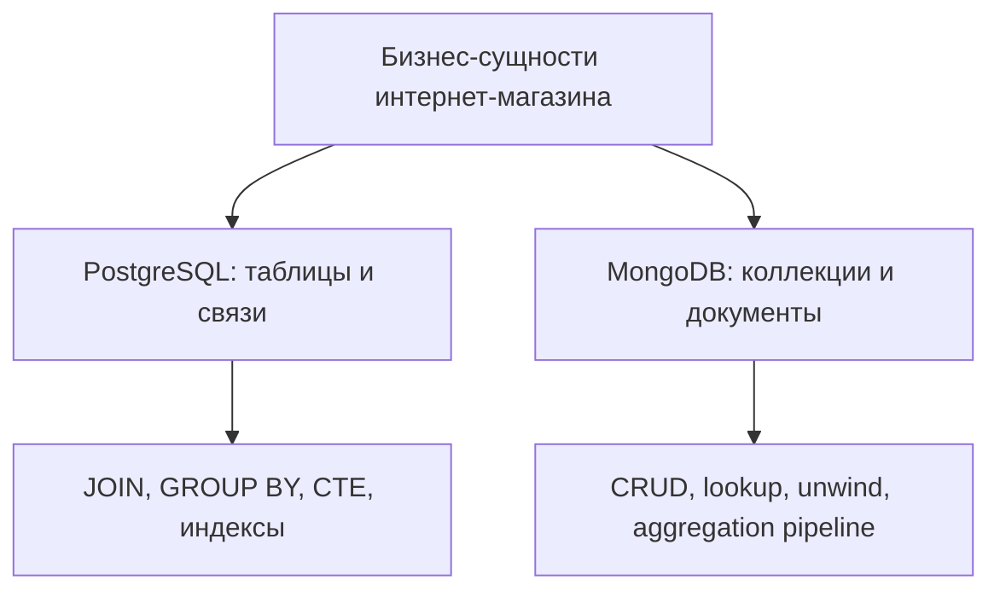
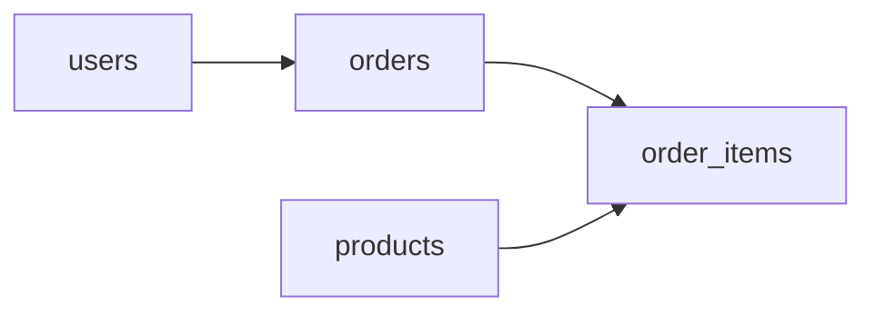
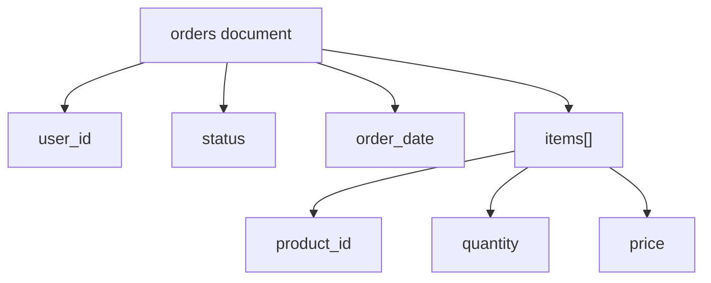

# Полное руководство по архитектуре: Лабораторная работа №14

Этот файл сделан в том же духе, что и теоретические файлы из `python-lab-12` и `python-lab-13`: его можно использовать как шпаргалку для защиты. Здесь собраны архитектура решений, смысл запросов, сравнение реляционной и документной моделей и короткие ответы на типовые вопросы преподавателя.

---

## 1. Общая идея лабораторной

Лабораторная №14 показывает два подхода к хранению данных интернет-магазина:

1. `PostgreSQL` как классическую реляционную СУБД.
2. `MongoDB` как документную NoSQL СУБД.

Обе части работают с одной бизнес-областью: пользователи, товары, заказы и позиции заказа. Это удобно для сравнения не в теории, а на одной и той же предметной модели.



---

## 2. Часть 1: PostgreSQL

### Архитектурная идея

В PostgreSQL данные нормализуются и раскладываются по связанным таблицам:

- `users`
- `products`
- `orders`
- `order_items`

Такой подход удобен, когда важны:

- строгая схема;
- внешние ключи;
- целостность данных;
- сложные аналитические запросы.



### Почему схема разбита на 4 таблицы

`users` и `products` хранят справочные данные, `orders` хранит сам факт заказа, а `order_items` хранит состав заказа. Это нормализованная модель, где одна строка не дублирует лишнюю информацию.

### Что важно понимать на защите

#### `JOIN`

`JOIN` нужен, когда данные логически связаны, но физически лежат в разных таблицах. Например, заказ хранит только `user_id`, а имя пользователя достаётся через `users`.

#### `GROUP BY`

`GROUP BY` нужен для агрегатов: суммы, количества, среднего значения. Если в запросе есть `SUM(...)`, то все неагрегируемые поля должны быть перечислены в `GROUP BY`.

#### `WHERE` и `HAVING`

- `WHERE` фильтрует строки до группировки.
- `HAVING` фильтрует уже агрегированные группы.

Именно поэтому условие вида “выручка больше 10000” ставится в `HAVING`, а не в `WHERE`.

#### `CTE`

`CTE` (`WITH ... AS ...`) удобен, когда аналитический запрос нужно разбить на читаемые этапы. Это делает SQL ближе к декларативному конвейеру обработки данных.

Пример логики:

```sql
WITH user_totals AS (
    SELECT u.user_id, u.full_name, SUM(oi.quantity * oi.unit_price) AS total_spent
    FROM users u
    JOIN orders o ON u.user_id = o.user_id
    JOIN order_items oi ON o.order_id = oi.order_id
    GROUP BY u.user_id, u.full_name
)
SELECT * FROM user_totals
ORDER BY total_spent DESC
LIMIT 3;
```

### Индексы и производительность

Индекс ускоряет поиск, потому что СУБД не обязана каждый раз просматривать таблицу целиком.

Ключевые термины:

- `Seq Scan` — последовательный просмотр всей таблицы;
- `Index Scan` — поиск через индекс;
- `EXPLAIN ANALYZE` — команда, показывающая реальный план выполнения и время.

Если запрос часто фильтрует `order_items` по `order_id`, то индекс:

```sql
CREATE INDEX idx_order_items_order_id ON order_items(order_id);
```

обычно переводит поиск с `Seq Scan` на `Index Scan`.

---

## 3. Часть 2: MongoDB

### Архитектурная идея

В MongoDB данные представляются в виде документов JSON-подобной структуры. Для интернет-магазина удобно хранить:

- коллекцию `users`;
- коллекцию `products`;
- коллекцию `orders`.

Внутри `orders` позиции заказа можно держать как вложенный массив `items`.



### Почему здесь используется вложенный массив

Для MongoDB естественно хранить состав заказа как часть самого документа заказа. Это снижает число отдельных сущностей и делает чтение одного заказа быстрее и проще.

### Что нужно понимать на защите

#### CRUD

- `insertMany` — вставка документов;
- `find` / `aggregate` — чтение;
- `updateMany` — массовое обновление;
- `deleteMany` — массовое удаление.

#### `$lookup`

`$lookup` — это аналог SQL `JOIN`, когда нужно подтянуть данные из другой коллекции.

#### `$unwind`

`$unwind` разворачивает массив документов в поток отдельных элементов. Это необходимо, если нужно агрегировать позиции заказа поштучно.

#### Aggregation Pipeline

Pipeline — это последовательность стадий обработки:

1. `$match`
2. `$lookup`
3. `$unwind`
4. `$group`
5. `$project`
6. `$sort`

Он похож на конвейер ETL прямо внутри базы данных.

Пример логики:

```javascript
db.orders.aggregate([
  { $unwind: "$items" },
  {
    $lookup: {
      from: "products",
      localField: "items.product_id",
      foreignField: "_id",
      as: "product_info"
    }
  },
  { $unwind: "$product_info" },
  {
    $group: {
      _id: "$product_info.category",
      total_quantity: { $sum: "$items.quantity" },
      total_revenue: { $sum: { $multiply: ["$items.quantity", "$items.price"] } }
    }
  },
  { $sort: { total_revenue: -1 } }
]);
```

---

## 4. PostgreSQL и MongoDB: ключевое сравнение

| Критерий | PostgreSQL | MongoDB |
|---|---|---|
| Модель данных | Таблицы и связи | Документы и коллекции |
| Целостность | Жёсткая схема, FK, CHECK | Более гибкая схема |
| Аналитика | Сильный SQL | Сильный pipeline |
| JOIN | Нативная сильная сторона | Через `$lookup`, обычно тяжелее |
| Гибкость структуры | Ниже | Выше |
| Идеальный сценарий | Финансовые и транзакционные системы | Быстро меняющиеся данные, JSON-документы |

Главная мысль: реляционная модель удобнее там, где важна строгая структура и сложные связи. Документная модель удобнее там, где выгодно хранить объект целиком.

---

## 5. Вопросы для защиты

**Почему в PostgreSQL заказ и позиции заказа вынесены в отдельные таблицы?**  
Потому что это нормализует схему, убирает дублирование и позволяет одному заказу хранить несколько товаров без повторения полей заказа.

**Почему в MongoDB `items` вложены в документ заказа?**  
Потому что документная модель хорошо подходит для хранения агрегата целиком: один заказ читается как один JSON-объект.

**Когда использовать `HAVING`, а когда `WHERE`?**  
`WHERE` используется до агрегирования, `HAVING` — после, когда фильтруются уже вычисленные суммы и количества.

**Что показывают `Seq Scan` и `Index Scan`?**  
`Seq Scan` означает, что таблица читается полностью. `Index Scan` означает использование индекса, что обычно быстрее при выборке по ключу или ограниченному диапазону.

**Чем `$lookup` отличается от SQL JOIN?**  
Логически они похожи, но в MongoDB это стадия pipeline над документами, а в SQL это базовый механизм работы реляционной модели.

---

## 6. Вывод

Лабораторная №14 важна не только для знакомства с двумя СУБД, но и для понимания того, что архитектура базы определяется не модой, а формой данных и характером запросов. PostgreSQL показывает силу строгой схемы и аналитического SQL, а MongoDB — силу гибкой документной модели и вложенных структур.
