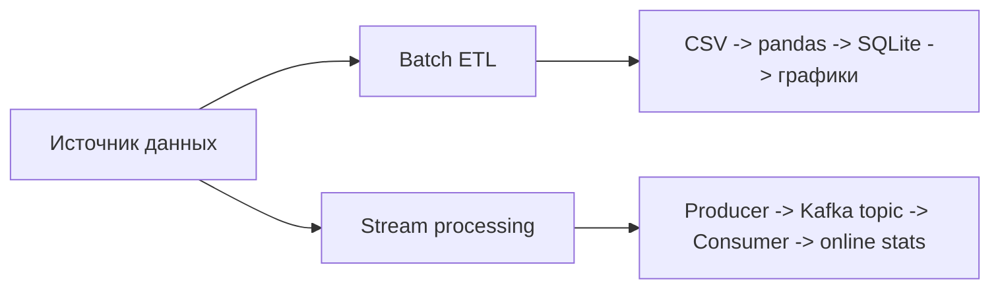
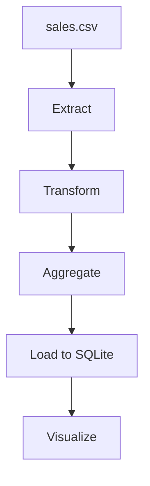
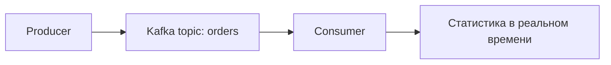

# Полное руководство по архитектуре: Лабораторная работа №15

Этот файл оформлен в той же логике, что и теория к предыдущим лабораторным: он помогает быстро вспомнить архитектуру, ключевые термины и смысл решений перед защитой.

---

## 1. Общая идея лабораторной

Лабораторная №15 посвящена обработке данных в двух режимах:

1. `ETL` — пакетная обработка данных из CSV в SQLite.
2. `Kafka` — потоковая обработка событий заказов в реальном времени.

Общий смысл лабораторной: показать разницу между batch-подходом и stream-подходом.

---

## 2. Часть 1: ETL-пайплайн

### Архитектурная идея

ETL расшифровывается как:

- `Extract` — извлечение;
- `Transform` — очистка и преобразование;
- `Load` — загрузка;
- в данной работе добавлен ещё и этап `Visualize`.

### Что делает пайплайн по шагам

#### Extract

На этом этапе CSV загружается через `pandas.read_csv`. Здесь важны:

- проверка существования файла;
- обработка пустого файла;
- логирование количества строк и колонок.

#### Transform

Это самый содержательный этап. В нём:

- удаляются дубликаты;
- заполняются пропуски;
- фильтруются аномалии;
- приводятся типы;
- считается `total_amount`;
- добавляется служебный признак `month_year`.

### Почему очистка данных обязательна

Если оставить:

- отрицательное количество;
- отсутствующую категорию;
- строки-дубликаты;

то итоговая аналитика будет неверной. ETL нужен не только для перемещения данных, но и для повышения их качества.

#### Aggregate

После очистки данные группируются, например по `category` и `month_year`, и вычисляются:

- общее количество проданных единиц;
- выручка;
- средняя цена;
- число уникальных заказов.

#### Load

Результат сохраняется в SQLite в две таблицы:

- `sales_cleaned`
- `sales_aggregated`

Это позволяет хранить и очищенный слой, и аналитический слой отдельно.

#### Visualize

Визуализация нужна не ради картинки, а ради интерпретации:

- barplot показывает выручку по категориям;
- lineplot показывает динамику по месяцам;
- pie chart показывает структуру общей выручки.

---

## 3. Часть 2: Kafka

### Архитектурная идея

Kafka нужна там, где данные появляются непрерывно и должны обрабатываться как поток событий, а не как пакетный CSV-файл.

### Основные сущности Kafka

- `broker` — сервер Kafka;
- `topic` — логическая очередь сообщений;
- `partition` — раздел топика;
- `producer` — отправитель;
- `consumer` — получатель;
- `consumer group` — группа обработчиков;
- `offset` — позиция сообщения в разделе.

### Producer

Producer генерирует события о заказах:

- `order_id`
- `timestamp`
- данные покупателя;
- список товаров;
- `total_amount`
- `payment_method`

Сообщения сериализуются в JSON и публикуются в топик `orders`.

Важно понимать, что producer не “обновляет таблицу”, а публикует факт события.

### Consumer

Consumer читает поток событий и по мере поступления обновляет агрегаты:

- общее число заказов;
- суммарную выручку;
- статистику по категориям;
- статистику по городам;
- список последних заказов.

Это уже не batch-аналитика, а near real-time обработка.

### Зачем нужен ключ сообщения

Если ключом сделать `customer_id`, Kafka сможет устойчиво распределять события одного клиента по одной и той же partition. Это важно для порядка обработки и консистентной аналитики.

---

## 4. ETL и Kafka: сравнение

| Критерий | ETL | Kafka |
|---|---|---|
| Режим работы | Пакетный | Потоковый |
| Источник | Файл, выгрузка, батч | События в реальном времени |
| Задержка | Минуты/часы | Секунды или меньше |
| Хранилище результата | SQLite / DWH | Агрегаты в памяти, БД, downstream systems |
| Основной сценарий | Отчётность и очистка истории | Онлайн-обработка событий |

Главная мысль: ETL хорош для “исторических” данных и регулярной загрузки. Kafka хороша для постоянного потока событий и онлайн-реакции системы.

---

## 5. Вопросы для защиты

**Почему ETL начинается с Extract, а не сразу с Transform?**  
Сначала данные нужно корректно и полностью получить из источника, иначе преобразовывать будет нечего.

**Почему дубликаты удаляются до агрегации?**  
Потому что иначе агрегаты будут завышены, а аналитика станет недостоверной.

**Зачем в ETL разделять очищенный и агрегированный слой?**  
Чтобы можно было отдельно анализировать подготовленные исходные данные и отдельно готовые витрины.

**Что такое `offset` в Kafka?**  
Это порядковый номер сообщения внутри partition, позволяющий consumer’у понимать, до какого места поток уже обработан.

**Чем consumer group полезна?**  
Она позволяет масштабировать обработку: несколько consumer’ов делят сообщения одного топика между собой.

**Почему Kafka лучше очереди “один producer — один consumer”?**  
Потому что Kafka хранит поток, поддерживает повторное чтение, масштабирование по partition и одновременную работу нескольких групп потребителей.

---

## 6. Вывод

Лабораторная №15 показывает два принципиально разных класса систем обработки данных. ETL отвечает за качество, подготовку и загрузку исторических данных. Kafka отвечает за непрерывное движение событий и обработку информации в реальном времени. Вместе они формируют базовый фундамент современной data-инфраструктуры.
