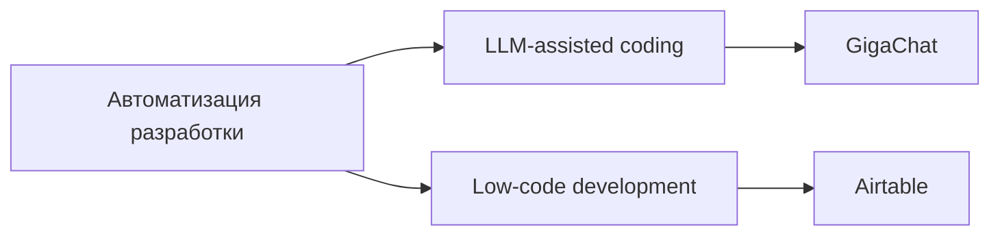
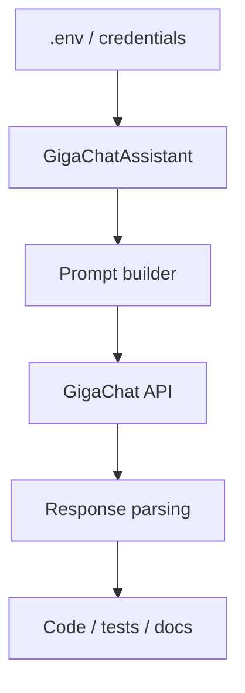
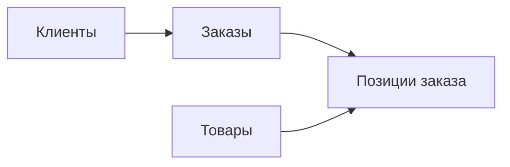

# Полное руководство по архитектуре: Лабораторная работа №16

Этот файл продолжает формат предыдущих лабораторных: он нужен как теоретическая опора для защиты и связывает две разные темы одной идеей автоматизации разработки — через ИИ и через low-code.

---

## 1. Общая идея лабораторной

Лабораторная №16 показывает два современных способа ускорения разработки:

1. `GigaChat` — ИИ-ассистент для генерации, рефакторинга, тестирования и документации кода.
2. `Airtable` — low-code платформа для быстрого создания CRUD-систем без классической backend/frontend-разработки.



Главная мысль лабораторной: не вся автоматизация выглядит одинаково. В одном случае ИИ помогает писать код, в другом — сама платформа уменьшает потребность в коде.

---

## 2. Часть 1: GigaChat

### Архитектурная идея

GigaChat используется как внешняя языковая модель, с которой приложение взаимодействует через API. В лабораторной строится клиент-обёртка `GigaChatAssistant`, который инкапсулирует типовые сценарии:

- `generate_code()`
- `refactor_code()`
- `generate_tests()`
- `generate_documentation()`



### Почему нужен отдельный клиент-класс

Если каждый запрос к модели писать вручную в разных скриптах, логика быстро дублируется. Класс-обёртка нужен, чтобы централизовать:

- авторизацию;
- выбор модели;
- промпты;
- постобработку ответа;
- очистку markdown-разметки.

### Что важно понимать на защите

#### Prompt engineering

Качество результата модели зависит от качества запроса. Хороший prompt:

- задаёт роль модели;
- точно описывает вход и ожидаемый выход;
- ограничивает формат ответа;
- перечисляет требования к качеству кода.

Пример: “Верни только код, без пояснений” нужен для того, чтобы ответ модели можно было сразу вставить в файл.

#### Refactoring с помощью LLM

Модель не “понимает проект как IDE”, а работает по текстовому контексту. Поэтому:

- нужно явно дать исходный код;
- нужно перечислить требования;
- нужно потом вручную проверить результат.

#### Генерация тестов

ИИ может быстро предложить набор позитивных, негативных и граничных кейсов, но он не гарантирует полноту покрытия и не всегда корректно понимает бизнес-логику. Тесты, созданные моделью, обязательно требуют ревью.

#### Генерация документации

LLM удобна для:

- docstring;
- README;
- API-описания;
- текстовых summary по функции или модулю.

Но документация остаётся качественной только тогда, когда код и документация проверяются вместе.

### Ограничения подхода

- модель может “галлюцинировать” несуществующие библиотеки;
- модель может упростить логику и потерять corner cases;
- модель не видит реальный runtime, если пользователь не дал ошибок;
- безопасность, производительность и совместимость надо проверять отдельно.

---

## 3. Часть 2: Airtable

### Архитектурная идея

Airtable представляет собой гибрид таблицы, базы данных, формы и lightweight CRM. Для лабораторной создаётся CRM для интернет-магазина с сущностями:

- `Клиенты`
- `Товары`
- `Заказы`
- `Позиции заказа`



### Почему Airtable считается low-code

Потому что большая часть поведения настраивается не через backend-код, а через:

- типы полей;
- ссылки между таблицами;
- lookup;
- rollup;
- formula;
- forms;
- automations;
- views.

### Ключевые механизмы

#### Link to another record

Это аналог внешнего ключа в SQL. Он связывает запись одной таблицы с записью другой.

#### Lookup

Позволяет подтянуть поле из связанной таблицы. Например, в позиции заказа автоматически показать цену товара.

#### Formula

Позволяет вычислять значение на лету. Например:

```text
{Количество} * {Цена на момент заказа}
```

#### Rollup

Позволяет агрегировать данные по связанным записям: считать сумму всех заказов клиента или количество позиций в заказе.

#### Views

Одни и те же данные можно показать по-разному:

- Grid;
- Kanban;
- Calendar;
- Form.

Это low-code эквивалент разных пользовательских представлений над одной схемой данных.

### Что важно понимать на защите

Low-code не отменяет проектирование данных. Даже если код писать почти не нужно, всё равно необходимо:

- правильно определить сущности;
- настроить связи;
- продумать валидацию;
- отделить справочники от транзакций;
- понимать, как считаются derived fields.

---

## 4. GigaChat и Airtable: сравнение ролей

| Критерий | GigaChat | Airtable |
|---|---|---|
| Что автоматизирует | Написание и анализ кода | Создание CRUD-системы |
| Нужен ли код | Да | Часто нет или минимум |
| Основной артефакт | Код, тесты, документация | Таблицы, формы, views, automations |
| Главный риск | Некорректный или небезопасный код | Ограничения гибкости и масштабируемости |
| Лучший сценарий | Помощь разработчику | Быстрый внутренний инструмент |

---

## 5. Вопросы для защиты

**Почему GigaChat нельзя использовать без ручной проверки результата?**  
Потому что модель генерирует вероятностный текст и может ошибаться в логике, API, безопасности и граничных случаях.

**Что делает хороший prompt?**  
Он уменьшает неопределённость: задаёт роль модели, формат ответа и критерии качества.

**Почему генерация тестов ИИ полезна, но не заменяет инженера?**  
Потому что модель может предложить тестовые сценарии, но не гарантирует полноту покрытия и понимание бизнес-рисков.

**Чем lookup отличается от rollup в Airtable?**  
Lookup просто подтягивает поле из связанной записи, а rollup агрегирует набор значений из связанных записей.

**Почему Airtable подходит для CRM-демо, но не всегда для большого production?**  
Потому что он очень удобен для быстрого старта, но уступает классическим системам в гибкости архитектуры, контроле логики и масштабировании.

---

## 6. Вывод

Лабораторная №16 показывает две стороны современной автоматизации разработки. GigaChat ускоряет работу программиста, но требует критического инженерного контроля. Airtable позволяет быстро собрать рабочую CRUD-систему почти без кода, но ограничивает глубину кастомизации. Вместе эти части хорошо демонстрируют, как меняется практика разработки в эпоху ИИ и low-code.
