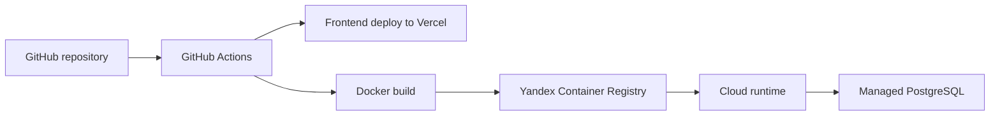
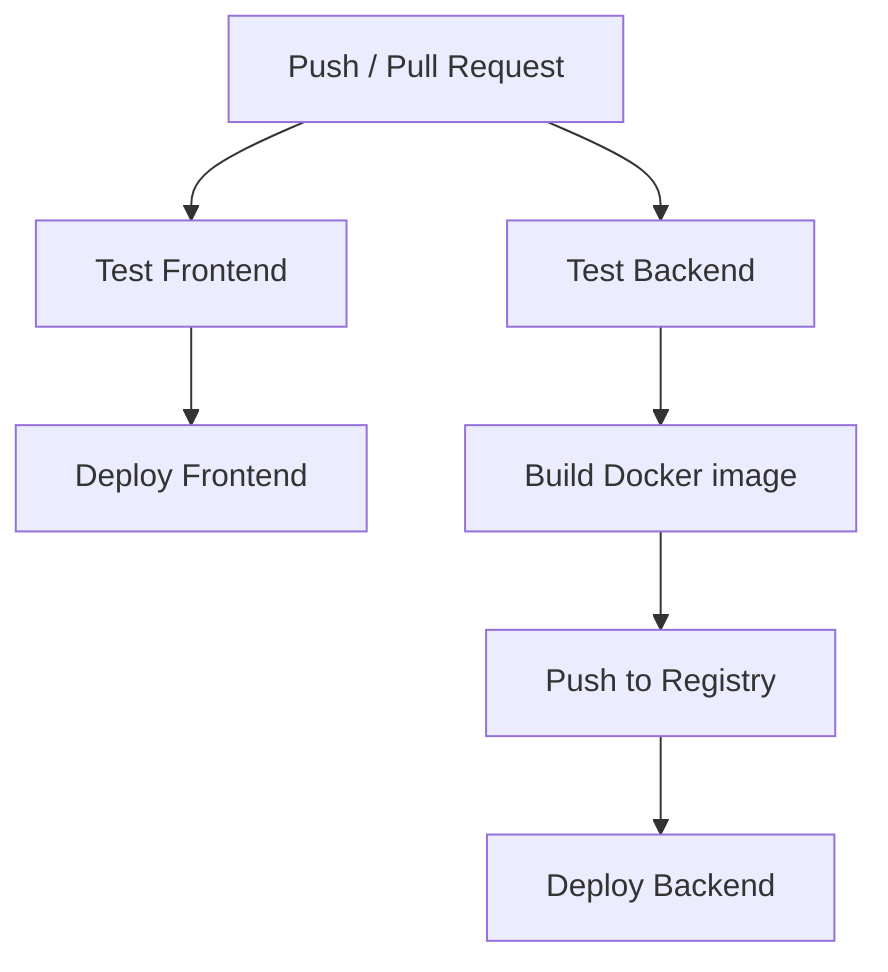

# Полное руководство по архитектуре: Лабораторная работа №17

Этот теоретический файл собран в том же формате, что и по предыдущим лабораторным: он помогает понять архитектуру деплоя, CI/CD-пайплайна и инфраструктуры как кода перед защитой.

---

## 1. Общая идея лабораторной

Лабораторная №17 показывает полный путь приложения от локальной разработки до автоматического деплоя:

1. `Deploy` — публикация фронтенда и бэкенда в облаке.
2. `CI/CD` — автоматизация тестирования, сборки, публикации и обновления сервисов.

---

## 2. Часть 1: Деплой в облаке

### Архитектурная идея

В работе разворачивается fullstack-система из двух частей:

- `Next.js` фронтенд;
- `FastAPI` бэкенд.

Фронтенд и бэкенд публикуются отдельно, потому что у них разные требования:

- фронтенд — это в основном статическая или server-side web-сборка;
- бэкенд — это API-сервис, которому нужна контейнеризация и доступ к базе данных.

### Почему фронтенд удобно размещать на Vercel

Vercel хорошо подходит для Next.js, потому что:

- автоматически понимает структуру проекта;
- умеет build и deploy из GitHub;
- выдаёт HTTPS и preview deployments;
- удобно работает с environment variables.

### Почему бэкенд контейнеризуется через Docker

Контейнер даёт:

- воспроизводимое окружение;
- контроль зависимостей;
- переносимость между локальной машиной и облаком;
- удобную публикацию в registry.

### Многостадийная сборка

В Dockerfile используется multi-stage build, чтобы:

- собрать зависимости в builder stage;
- перенести только нужные артефакты в финальный образ;
- уменьшить размер итогового контейнера.

### Роль управляемой PostgreSQL

База вынесена в отдельный managed-сервис, потому что:

- база должна жить независимо от контейнера API;
- обновление приложения не должно уничтожать данные;
- резервное копирование и сетевые настройки удобнее делегировать облаку.

---

## 3. Часть 2: CI/CD

### Архитектурная идея

CI/CD-пайплайн строится вокруг GitHub Actions и разделяется на стадии:

1. тестирование фронтенда;
2. тестирование бэкенда;
3. деплой фронтенда;
4. сборка и публикация backend image;
5. обновление backend runtime.

### Почему пайплайн делится на job’ы

Разделение на job’ы даёт:

- параллелизм;
- изоляцию окружений;
- более понятные причины падения;
- зависимость следующего этапа от успешности предыдущего.

### CI: что проверяется до деплоя

Для фронтенда:

- `npm ci`
- lint
- type-check
- build

Для бэкенда:

- установка зависимостей;
- тесты `pytest`;
- проверка покрытия;
- security scan через `bandit`.

Это делает пайплайн не просто доставкой, а качественным gatekeeper.

### CD: что происходит при push в `main`

После успешных тестов:

- фронтенд выкладывается на Vercel;
- бэкенд собирается в Docker image;
- image пушится в Yandex Container Registry;
- runtime обновляется до нового образа.

Такой процесс минимизирует ручные шаги и снижает риск “человеческого фактора”.

### Зачем нужны GitHub Secrets

Пайплайну нужны токены и ключи:

- `VERCEL_TOKEN`
- `YC_SA_KEY_JSON`
- `YC_REGISTRY_ID`
- `DB_URL`

Секреты нельзя хранить в репозитории, поэтому они выносятся в GitHub Secrets и подставляются только в момент выполнения workflow.

---

## 4. Infrastructure as Code

Даже если в отчёте Terraform фигурирует как следующий шаг, важно понимать сам принцип `IaC`.

Infrastructure as Code означает, что:

- инфраструктура описывается декларативно;
- конфигурация хранится в репозитории;
- изменения инфраструктуры проходят review, как и обычный код;
- окружения можно воспроизводить.

Это делает облачную инфраструктуру управляемой, версионируемой и менее хаотичной.

---

## 5. Ручной деплой и CI/CD: сравнение

| Критерий | Ручной деплой | CI/CD |
|---|---|---|
| Скорость | Ниже | Выше |
| Повторяемость | Низкая | Высокая |
| Риск ошибки | Высокий | Ниже |
| Прозрачность | Зависит от человека | Логи и артефакты фиксируются |
| Масштабируемость | Плохо | Хорошо |

Главная мысль: ручной деплой может быть приемлем для эксперимента, но для реальной команды нужен автоматизированный pipeline.

---

## 6. Вопросы для защиты

**Почему фронтенд и бэкенд деплоятся раздельно?**  
Потому что это разные типы приложений с разными окружениями, жизненным циклом и инфраструктурными требованиями.

**Зачем нужен Docker, если приложение уже работает локально?**  
Чтобы зафиксировать зависимости и окружение, сделав приложение одинаковым при локальном запуске, тестировании и в облаке.

**Почему база данных не должна жить внутри контейнера API?**  
Потому что контейнер приложения — эфемерный объект, а база данных требует устойчивого хранения и отдельного управления.

**Что даёт GitHub Actions по сравнению с ручными командами?**  
Он выполняет одни и те же шаги одинаково, автоматически и с полным логом.

**Что такое CI, а что такое CD?**  
CI — это continuous integration: автоматические проверки при изменении кода.  
CD — continuous delivery/deployment: автоматическая доставка и выкладка новой версии.

**Зачем хранить инфраструктуру как код?**  
Чтобы инфраструктура стала воспроизводимой, контролируемой и проверяемой так же, как и обычный исходный код.

---

## 7. Вывод

Лабораторная №17 связывает разработку и эксплуатацию в единый процесс. Деплой в облаке показывает, как приложение переходит из локального окружения в production-like среду. CI/CD показывает, как этот переход автоматизировать, сделать безопаснее и воспроизводимее. Это ключевой шаг от “просто написать код” к инженерной поставке программного продукта.
